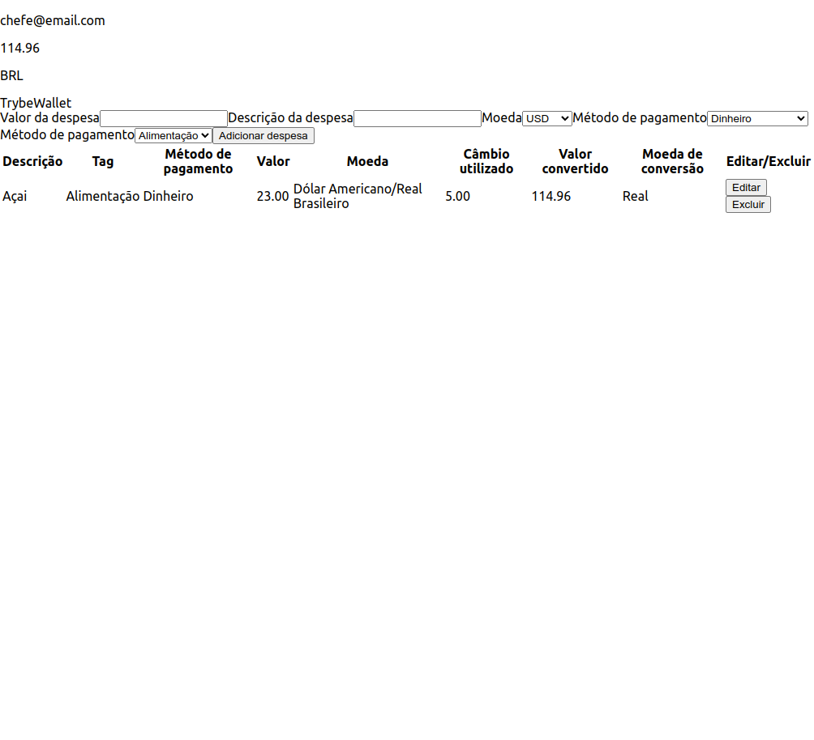

># Trybewallet

## Projeto completo! (Estilização em construção)

## Sobre o projeto
        Este projeto foi desenvolvido no módulo de front-end da Trybe, na data 13/04/2023,
        onde eu consegui colocar em prática os meus aprendizados até então.
        O projeto é um CRUD, em redux, de carteira virtual de despesas, onde o usuário, 
        pode adicionar uma nova despesa, a tabela consegue lê a nova adição, pode editar 
        a despesa e deletar a despesa. Além de que o usuário pode escolher uma moeda e a 
        tabela faz uma conversão para a moeda selecionada, buscando em uma API de conversão 
        de moedas.
         

># 🔗 [Acesse clicando aqui!](https://luandersonalvesdev.github.io/trybewallet/#/)

## 👨‍💻 APRENDIZADO
- Adicionar e configurar Redux ao React.
- Fazer reducers, actions e dispatchers no Redux.
- Conectar Redux aos componentes React.
- Fazer um CRUD com Redux em aplicações React.
- Código assíncrono com React componentes de classe.

## 🛠️ TECNOLOGIAS USADAS 
- React
- Redux
- JavaScript
- React Testing Library

## CONTATO

https://linkedin.com/in/luandersonalvesdev
